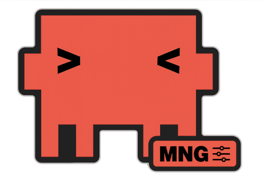

<div align="center">
  

  <h1>Claude Code Session Manager — ccsm</h1>

  <p>List, search, and summarize your saved Claude Code sessions from the terminal.</p>

  <p>
    <a href="https://github.com/nemethk/claude-code-session-manager/releases"></a>
    <a href="https://github.com/nemethk/claude-code-session-manager/actions/workflows/ci.yaml"></a>
    <a href="LICENSE"></a>
    
    
    <a href="https://claude.ai/claude-code"></a>
  </p>
</div>

---

## ❓ The Problem

Claude Code saves every session locally — but finding a past conversation requires guessing a UUID or scrolling through `~/.claude/projects/`. There is no built-in way to search or list what you've worked on.

`ccsm` solves that.

---

## ⚙️ How It Works

Sessions are stored as JSONL files in `~/.claude/projects/<project-slug>/<uuid>.jsonl`. `ccsm` walks that directory, parses the messages, and presents them as a searchable, summarizable list.

```
~/.claude/projects/
  -home-user-Dev-myapp/
    cc928331-e2fa-4542-992e-f1fded2deb08.jsonl   ← one file per session
    2803b936-7cb5-499f-804a-3804351f4b94.jsonl
```

```bash
ccsm list

# DATE        TIME   UUID                                  PROJECT       SUMMARY
# 2026-06-14  09:23  2803b936-7cb5-499f-804a-3804351f4b94  ~/Dev/myapp   fix the auth bug in the login flow
# 2026-06-13  14:51  cc928331-e2fa-4542-992e-f1fded2deb08  ~/Dev/myapp   refactor the payment service
```

---

## 🔧 Prerequisites

| Dependency | Required | Purpose |
|---|---|---|
| [Claude Code](https://claude.ai/claude-code) | for `--ai` and `summarize` | Generates AI summaries via `claude` CLI |
| [fzf](https://github.com/junegunn/fzf) | optional | Fuzzy session picker for resume alias |

---

## 📦 Installation

**macOS / Linux:**

```bash
curl -fsSL https://raw.githubusercontent.com/nemethk/claude-code-session-manager/main/scripts/install.sh | bash
```

**Homebrew:**

```bash
brew install nemethk/tap/ccsm
```

**Go:**

```bash
go install github.com/nemethk/claude-code-session-manager@latest
```

**From source:**

```bash
git clone https://github.com/nemethk/claude-code-session-manager
cd claude-code-session-manager && make install
```

---

## 🛠️ Commands

### `ccsm list`

List all sessions, sorted by most recently active.

```bash
ccsm list                          # all sessions
ccsm list --project myapp          # filter by project path substring
ccsm list --since 2026-06-01       # filter by date
ccsm list --min-turns 2            # hide single-message sessions
ccsm list --json                   # machine-readable JSON output
```

The SUMMARY column shows a cleaned excerpt of the first user message with key file references. Use `--ai` to replace it with a Claude-generated one-liner (cached for future runs):

```bash
ccsm list --ai                     # generate AI summaries for uncached sessions
```

AI summaries are cached in `~/.cache/ccsm/` — subsequent `ccsm list` runs show them instantly at no cost.

---

### `ccsm summarize <uuid>`

Generate a detailed AI summary of a specific session: what was worked on, key steps, and outcome. Uses the `claude` CLI directly — requires Claude Code to be installed and authenticated.

```bash
ccsm summarize 2803b936

# Session:  2803b936-7cb5-499f-804a-3804351f4b94
# Project:  ~/Dev/myapp
# Date:     2026-06-14 09:23
# Turns:    43
#
# **What was worked on:** ...
# **Key steps:**
# - ...
# **Outcome:** ...
```

UUID prefix is enough — same as `git log --abbrev-commit`.

---

### `ccsm search <term>`

Filter sessions where the first message or project path contains the term.

```bash
ccsm search postgres
ccsm search "auth bug"
ccsm search kubernetes --json
```

---

### `ccsm show <uuid>`

Print the first N raw user messages from a session — useful for previewing what was discussed before resuming.

```bash
ccsm show 2803b936                 # UUID prefix is enough
ccsm show 2803b936 --turns 10      # show more turns (default: 5)
```

---

## ▶️ Resume a Session

`ccsm` outputs the UUID you need — pass it to `claude --resume`:

```bash
claude --resume 2803b936-7cb5-499f-804a-3804351f4b94
```

**With fzf** — fuzzy-pick and resume in one command:

```bash
ccsm list | fzf | awk '{print $3}' | xargs claude --resume
```

Add as a shell alias:

```bash
alias cr='ccsm list | fzf | awk '"'"'{print $3}'"'"' | xargs claude --resume'
```

---

## 🤖 Claude Code Skill

`ccsm` ships with a `/sessions` skill that adds natural language search on top of the binary.

**Install:**

```bash
cp skill/sessions.md ~/.claude/skills/sessions.md
```

Or download directly:

```bash
curl -fsSL https://raw.githubusercontent.com/nemethk/claude-code-session-manager/main/skill/sessions.md \
  -o ~/.claude/skills/sessions.md
```

**Usage inside any Claude Code session:**

```
/sessions                              → numbered list of all sessions
/sessions find postgres                → Claude filters by relevance
/sessions show 2803b936               → inspect turns before resuming
/sessions resume 2803b936             → prints the claude --resume command
```

The skill calls `ccsm list --json` via the Bash tool and uses Claude to reason over the structured output — semantic search without indexing.

---

## ⚡ Configuration

| Variable | Default | Purpose |
|---|---|---|
| `CCSM_SESSIONS_DIR` | `~/.claude/projects` | Override the sessions directory |

---

## 🧪 Development

```bash
go test ./...
```

Tests are split into two packages:

- `internal/session` — unit tests for JSONL parsing, path extraction, text matching
- `tests/` — end-to-end tests that build the binary and run it against fixture sessions

---

## 📜 License

[MIT](LICENSE)
